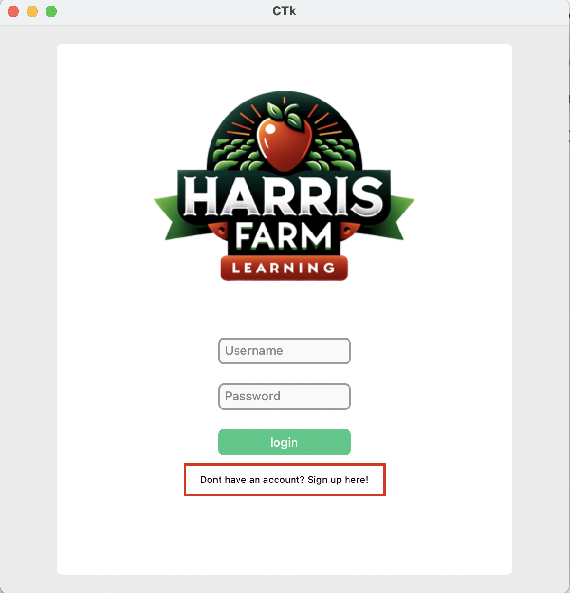
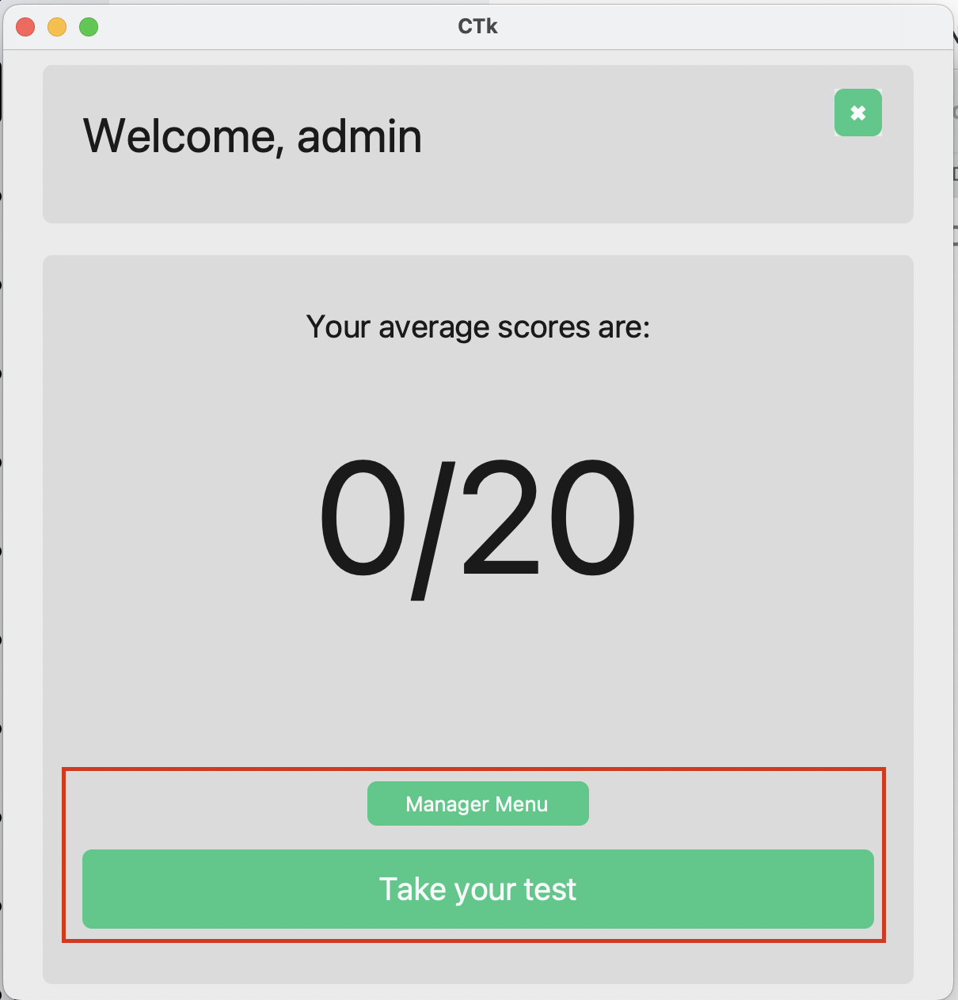
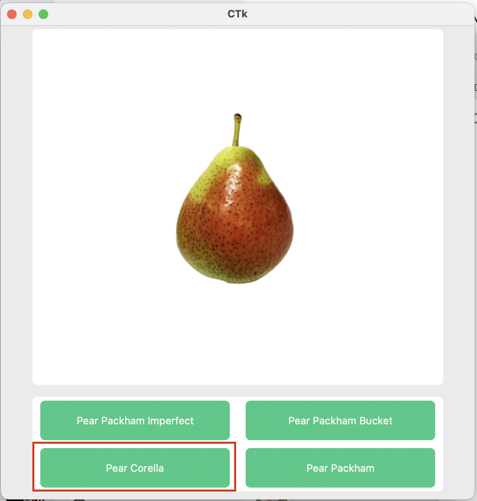

# HFM Learning

## Description
HFM Learning is an educational platform designed to provide interactive quizzes and learning modules for users. The application includes user authentication, personalized score tracking, and a managerial interface for overseeing user performance.

## Installation Instructions 
1. **Install Python**:
    - **Windows and Mac**:
      1. Download the Python installer from the [official website](https://www.python.org/downloads/).
      2. Run the installer and ensure you check the box that says "Add Python to PATH".
      3. Follow the installation prompts.

## Terminal install:
  
2. Clone the repository to your local machine within your termail:
    ```bash
    git clone https://github.com/yourusername/hfm-learning.git
    ```
3. Navigate to the project directory:
    ```bash
    cd hfm-learning
    ```
4. Install the required dependencies:
    ```bash
    pip install customtkinter pillow pandas bcrypt

    ```
5. Run the application:
    ```bash
    python main.py
    ```
## Link install: 

If you would like to download my application you can downlaod the zip file. You can download it [here](https://github.com/IggyMeagher/major-project/archive/refs/heads/main.zip).

1. Once you have downloaded this, you can unzip it using winrar, or any other unzipping file. [winrar](https://www.win-rar.com/download.html?&L=0) on MacOs, it comes pre-installed so no need to download winrar or and unzipping for for that matter

2. Once the file is unzipped, make sure everything is there and you can run this in your terminal, only if python is isntalled. 

 ```bash
    python main.py
 ```

Now you should be within the app, enjoy. 


## How to Use
1. **Login Page**: Enter your username and password to log in. If you do not have an account, click the sign-up link to register. If you 
purpouses, you can use the admin, admin username and password. 
    
2. **Home Page**: After logging in, you will see your score and the option to take a test. Click this option, and you will be led into the testing fuction of the application
    
3. **Quiz Page**: Answer the quiz questions by selecting the correct option based off of the promt given within this example, it is a corella pear and it is correct!
    
4. **Manager Page**: Accessible to admin users, this page displays users who need assistance based on their scores. There are some filler users to demonstrate the full functionality of this

## License Information
This project is licensed under the MIT License.

MIT License

Copyright (c) [2024] [Ignatius Meagher]

Permission is hereby granted, free of charge, to any person obtaining a copy
of this software and associated documentation files (the "Software"), to deal
in the Software without restriction, including without limitation the rights
to use, copy, modify, merge, publish, distribute, sublicense, and/or sell
copies of the Software, and to permit persons to whom the Software is
furnished to do so, subject to the following conditions:

The above copyright notice and this permission notice shall be included in all
copies or substantial portions of the Software.

THE SOFTWARE IS PROVIDED "AS IS", WITHOUT WARRANTY OF ANY KIND, EXPRESS OR
IMPLIED, INCLUDING BUT NOT LIMITED TO THE WARRANTIES OF MERCHANTABILITY,
FITNESS FOR A PARTICULAR PURPOSE AND NONINFRINGEMENT. IN NO EVENT SHALL THE
AUTHORS OR COPYRIGHT HOLDERS BE LIABLE FOR ANY CLAIM, DAMAGES OR OTHER
LIABILITY, WHETHER IN AN ACTION OF CONTRACT, TORT OR OTHERWISE, ARISING FROM,
OUT OF OR IN CONNECTION WITH THE SOFTWARE OR THE USE OR OTHER DEALINGS IN THE
SOFTWARE.


## Visuals
Here are some screenshots of the application:
1. Login Page:
    
2. Home Page:
    
3. Quiz Page:
    

## Acknowledgements
- CustomTkinter for providing the customizable Tkinter widgets.
- Bcrypt for the secure password hashing.
- Pandas for data manipulation and CSV handling.
- Mr Jeffery and Fong for helping me in the apps creation

## Author Details
- **Name**: Ignatius Meagher
- **Contact**: Ignatius.meagher@gmail.com

